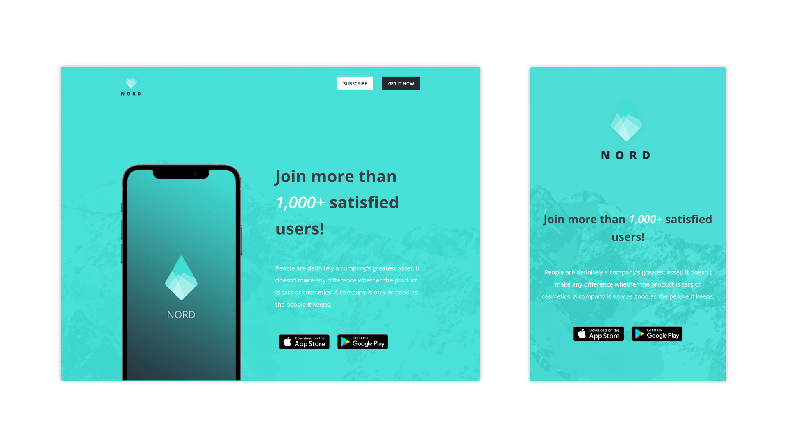

# Nord Mobile Application's Website
A presentation website for Nord mobile application created with HTML and CSS!

**Note:** This website is created for practicing on the front-end.

## Design View

## Live Demo
👁 [Click here](https://mohammadjarabah.github.io/Nord-Mobile-Application-Website) to check out the live demo!

## Technologies Used
* 
* 

## Features
* 🤖 Responsive design on all devices
* ⚡ Fast and lightweight design
* 📱 Simple mobile animation at the header section
* 🌐 Sections for Header, About, Quote, and Join us
* ✨ And more!

## Credits
* PSD Template is from [Graphberry](https://www.graphberry.com)
* Fonts are from [Google Fonts](https://fonts.google.com)
* Images are from [Unsplash](https://unsplash.com)
* Mockups are from [Smart Mockups](https://smartmockups.com)
