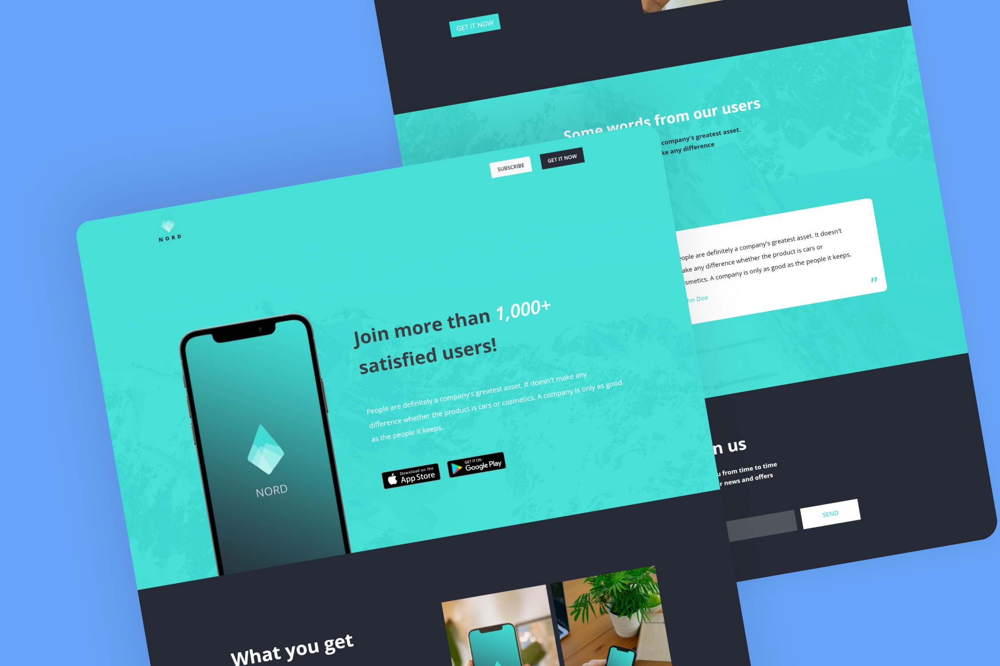

<h1 align='center'>Nord Mobile Application Website</h1>

Transformed a PSD web template into a sleek landing page using HTML and CSS. Designed for mobile app promotion, ensuring responsiveness across devices. Incorporated intuitive navigation and visually appealing layout for user engagement. Completed project with a clean code and efficient design, as well as, optimizing user experience.

## Preview

## Live Demo
👁 [Click here](https://mohammadjarabah681.github.io/nord-mobile-application-website) to check out the live demo!

## Technologies
* HTML
* CSS (with BEM Methodology)

## Features
* ⭐ Single page design
* 👓 Elegant favicon
* 🤖 Responsive design on all devices
* ⚡ Fast and lightweight design
* 📱 Simple mobile animation at the header section
* 🌐 Sections for Header, About, Quote, and Join us
* 🎨 SVG logo
* 🌱 Smooth scroll for navigation bar links
* ✨ And more!

## Credits
* PSD Template is from [Graphberry](https://www.graphberry.com)
* Fonts are from [Google Fonts](https://fonts.google.com)
* Images are from [Unsplash](https://unsplash.com)
* Mockups are from [Smart Mockups](https://smartmockups.com)

## License
This project is licensed under the [MIT License](./LICENSE).